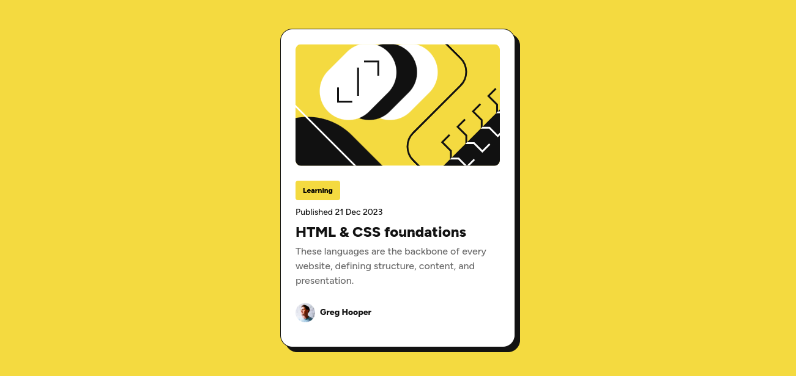

# Frontend Mentor - Blog preview card solution

This is a solution to the [Blog preview card challenge on Frontend Mentor](https://www.frontendmentor.io/challenges/blog-preview-card-ckPaj01IcS). Frontend Mentor challenges help you improve your coding skills by building realistic projects. 

## Table of contents

- [Overview](#overview)
  - [Screenshot](#screenshot)
  - [Links](#links)
- [My process](#my-process)
  - [Built with](#built-with)
  - [What I learned](#what-i-learned)
  - [Useful resources](#useful-resources)
- [Author](#author)

## Overview

### Screenshot



### Links

- Repo URL: [Code Repository](https://github.com/Melbita/Blog-preview-card)
- Live Site URL: [Live Site](https://melbita.github.io/Blog-preview-card/)

## My process

### Built with

- Semantic HTML5 markup
- CSS custom properties
- Flexbox
- Mobile-first workflow

### What I learned

I learned about the usage of  filter: drop-shadow css property

https://developer.mozilla.org/en-US/docs/Web/CSS/filter-function/drop-shadow 

```css
  filter: drop-shadow(var(--color-gray-950) 8px 8px);
```
### Useful resources

- [Filter: drop-shadow](https://developer.mozilla.org/en-US/docs/Web/CSS/filter-function/drop-shadow ) - This helped me to achieve card's shadow

## Author

- Frontend Mentor - [@melbita](https://www.frontendmentor.io/profile/melbita)